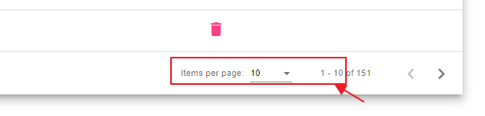
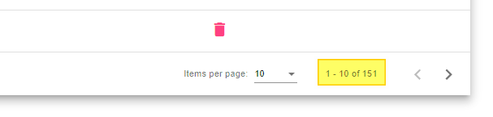
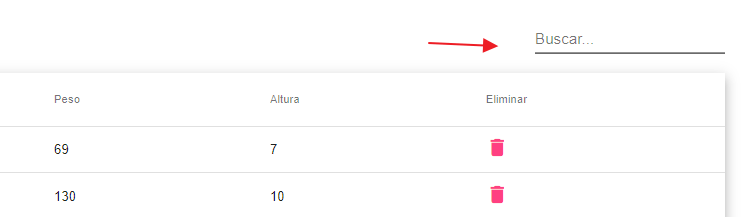
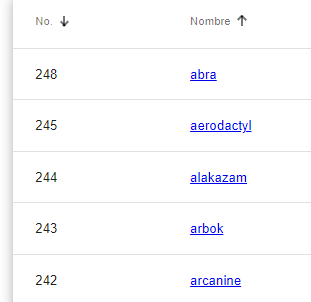
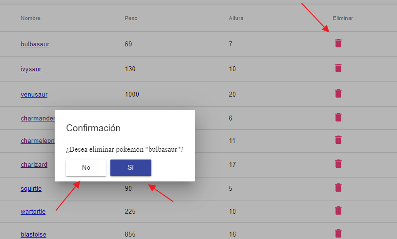

# ApiPokemon

Este proyecto es una prueba personal que utiliza la [API de Pokémon](https://pokeapi.co) y está desarrollado en el framework Angular.

## Versiones

- Angular CLI: 1.6.6 - 5.2
- Node: 8.11.3

## Características

### Listado de Pokémon (151):
- La api contiene un listado de 1302 Pokémon, pero la aplicación presenta un listado máximo de **151 Pokémon** según indicaciones.

### Paginación:
- La lista de Pokémon está paginada cada 10 registros para facilitar la navegación.

### Menú Global de Búsqueda:
- Los usuarios pueden realizar búsquedas para encontrar rápidamente a su Pokémon.
- Se muestra un menú en todas las páginas para permitir a los usuarios realizar búsquedas desde cualquier lugar de la aplicación.

### Ordenación:
- Los Pokémon pueden ordenarse por número y nombre para una mejor organización.
- Se realizó un ordenamiento dentro de la tabla y tambien fuera.

### Eliminación de Pokémon:
- Los usuarios tienen la capacidad de eliminar a un Pokémon de la lista.
- En este caso no se elimina como tal, sino que se oculta por ser traido por un API todos los registros, y al recargar la pagina se puede volver a llamar a la lista completa.

